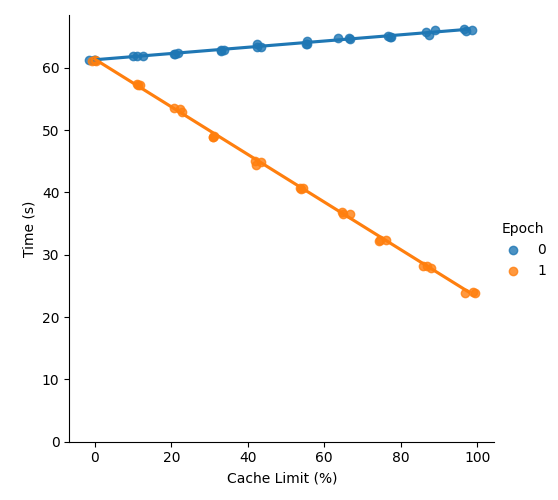
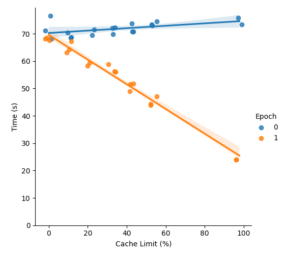

# Stochastic Caching

Is your training pipeline data-bottlenecked? Are you looking for a zero-effort speedup? You've come to the right place!

Introducing `stocaching`, a tiny (1 file) library for stochastic dataset caching in PyTorch.

See [this blog post]() if you want to understand the benefits, motivation, and decisions behind the library.

Feel free to simply copy-paste the module into your projects! Alternatively, you can install with pip:

```bash
pip install stocaching
```

## Usage

Adding stochastic caching to your existing datasets is dead simple. Simply follow these two steps:

1. Create a `SharedCache` object in the `__init__` method of your dataset. You tell `SharedCache` about the size of your dataset and the maximum amount of space you want the cache to take up. `SharedCache` then calculates the maximum number of samples that can fit, and allocates that many slots to store data in.

2. In the `__getitem__` method of your dataset, interact with the `SharedCache` object to either read the data from the cache (if it has already been cached), or write the data to the cache (if it has not yet been cached).

You can get and set items in the cache with `x = cache[idx]`, and `cache[idx] = x`. You can picture the cache as a list-like structure with a slot for each sample.

When the dataset is too large to cache completely, `len(cache) < len(dataset)`. If you used the getter and setter directly, you would end up with lots of fiddly code to check if idx is in bounds for the cache. We provide two convenience methods `get_slot`, and `set_slot`, which allow you to treat the cache as if it has the same length as the dataset. Using `get_slot` out of bounds of the cache simply returns `None`. Using `set_slot` out of bounds is a no-op. These methods are designed to minimise the amount of code you need to write in the `__getitem__` method of your dataset.

**Advanced:** Internally, the cache is simply a single pytorch array, backed by shared memory. You can access the underlying array with the `underlying_array` property.

## Example

```python
import torch
from stocaching import SharedCache
from torch.utils.data import Dataset

class MyDataset(Dataset):
    def __init__(self):
        super().__init__()

        ... # set up dataset

        dataset_len = N   # number of samples in the full dataset
        data_dims = (C, H, W)   # data dims (not including batch)

        # initialize the cache
        self.cache = SharedCache(
            size_limit_gib=32,
            dataset_len=dataset_len,
            data_dims=data_dims,
            dtype=torch.uint8,
        )

    def __getitem__(self, idx):
        # retrieve data from cache if it's there
        x = self.cache.get_slot(idx)
        # x will be None if the cache slot was empty or OOB
        if x is None:
            x = ... # load data to uint8 tensor from disk
            self.cache.set_slot(idx, x) # try to cache x
        return x
```

## Benchmarks

We run some basic benchmarks for stochastic caching under a realistic workload -- single GPU image classification.

We train `mobilenet_v3_small` on a 50k sample dataset for two epochs. The reason we use such a tiny model is to ensure that we are in the dataloading-bottlenecked regime. In the first epoch, the stochastic cache is being lazily filled. In the second epoch, the cache is being read from.

We perform two sets of experiments: one with the data on a local HDD, and one with the data being read from another machine on the network. All experiments are run on the same machine: RTX 3090 GPU, i9 10th gen CPU.

In all epochs apart from the first, stochastic caching gives a speedup that scales linearly with the percentage of the dataset being cached. There is a very small overhead in the first epoch (due to filling the cache), but by the end of the second epoch, the speedup from caching more than compensates for this.

|          Local HDD          |         Remote data          |
| :-------------------------: | :--------------------------: |
|  |  |

## FAQ

### How much memory should I allocate to the cache?

As much as you like! The speedup from caching scales linearly with the % of your dataset being cached.

The shared memory is stored in `/dev/shm` (tmpfs), so this is likely the limiting factor for you. We provide a convenience function `get_shm_size` to check how large it is. Alternatively, check with `df -h`.

Most Unix-like systems have `/dev/shm` pre-set to 50% of your RAM. You can temporarily resize it (e.g. to 128 GiB) by running: `mount -o remount,size=128G /dev/shm`.

### How does this interact with augmentations/transforms?

Generally, you don't want to do any random augmentations before caching because the cache will kill the randomness. It's also a good idea to cache data in uint8 format (instead of float32) to save space.

Splitting your transforms/augmentation pipeline into two phases is a good idea. The first phase converts your data to a (possibly resized) uint8 tensor. The output of this phase gets cached. The second phase should do random augmentations, convert to float32, and normalise. This phase happens 'on-line' and the output goes straight into your model.

For an example of how to do this properly, see the implementation in `benchmark/dataset.py`. You can also read the [blog post]() for more information.

### Does this work with multi-GPU (DDP) training?

Almost. I'll push an update to support it soon.

### How do I reproduce the benchmarks?

If you feel like it, please reproduce these benchmarks on your setup!

We benchmark the method with the minimal example in the `benchmark/` dir. You may perform a single benchmark run like so:

```bash
python run_benchmark.py --data-dir="your-data-dir" --cache-limit-gib="your-cache limit"
```

Set `data-dir` to a location on an HDD or network drive. The first time you run the code, a random dataset will be generated in this directory. Set `cache-limit-gib` to 0 to disable caching, or to an integer less than the size of `/dev/shm`.

By default, the benchmark script generates a dummy dataset, with 50k (3,512,512) jpg images. This takes around 7.5 GiB on disk. Around 9 GiB of shared memory is needed to fully cache the dataset.

All our benchmarks use the default hyperparameters specified in the `run_benchmark.py` file {batch_size: 256, num_workers: 8, pin_memory: True}.

You can run the entire benchmark sweep like so:

```bash
./run_sweep.sh "YOUR_DATA_DIR" "YOUR_OUTPUT_DIR"
```

You may then reproduce our plots by running:

```bash
python analyse_sweep.py --csv_dir="WHERE_YOU_SAVED_THE_OUTPUTS" --fig-save-dir="assets/"
```
